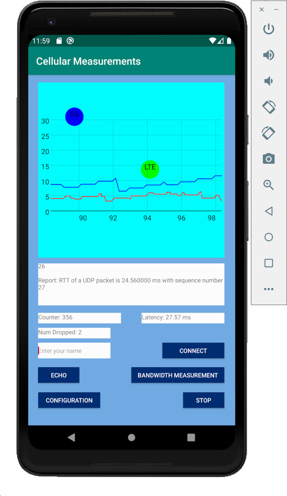
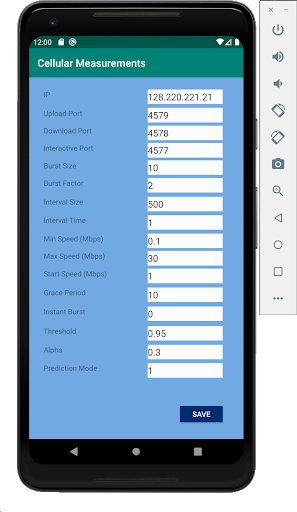

# Cellular Measurement Tools
UDP based applications written in C to do bidirectional bandwidth/latency measurements between cellular and server. It also includes 
a server to manage packets when the interactive application is running.
You can find the cellular measurement Android application [here](https://github.com/jerrychen017/cellular-measurement-android.git).

## Functionalities:
### Bidirectional Bandwidth Measurement Application
* A bidirectional client-server program
* Used to measure upload and download speed over cellular/wired links
* Application spawns sender and receiver threads
* Each sender consists of a controller and a data generator
* Data generator is responsible for creating data at a bitrate and the controller is responsible for doing packet bursting and adjusting the sending bitrate
* Receiver is able to estimate bandwidth with two different methodologies Running Average and EWMA
* Grace Period is the number of times that we allow bandwidth estimations on the receiver to drop below our set threshold before we need to act on it

### Interactive Application
* A client-server program allowing multiple users to move balls on a shared canvas in Android. 
* It's used to provide a tangible sense of timeliness. 
* Works in conjunction with an [Android application](https://github.com/jerrychen017/cellular-measurement-android.git) that sends coordinates to the interactive server
* The server echoes back the tapped coordinates on the Android application canvas
* The Android application will then draw circles based on the send back coordinates.

## Instructions for running
(server programs and the CLI client program are located under the directory `executables/`)
### Bandwidth Measurement
1.  Run `bandwidth_server` program on a server with three UDP ports open (also open for TCP if you want to test on TCP as well):
```
./bandwidth_server <server_send_port> <server_recv_port>
```
e.g. 
```
./bandwidth_server 4576 4577
```
#### Please note that `<server_send_port>` should be the same as `<client_recv_port>`; similarly, `<server_recv_port>` and `<client_send_port>` should be the same. 

2. Run the Android App on your phone or on an Android Studio emulator  
  
 * `Bandwidth Measurement` button measures upload/download speed (app will start graphing).
 * `Stop` button stops the bandwidth measurement. 
 * `Configuration` button brings you to the configuration page where you can modify parameters. 

#### Before running `Bandwidth Measurement`, go to `Configuration` and make sure `Upload Port` is the same as `<server_recv_port>` and `Download Port` is the same as `<server_send_port>`

3. (Optional) Run the CLI Client program if you don't have an Android phone or Android studio 
```
./bandwidth_client <server_address> <client_send_port> <client_recv_port> <EWMA/RunningAvg> <grace_period> <use_tcp>
```
e.g. 
```
./bandwidth_client 123.123.123.123 4577 4576 1 10 0
```

### Interactive Application
1. run `interactive_server`:
```
./interactive_server <interactive_port> <max_num_users> 
```
e.g.
```
./interactive_server 4578 10 
```
Once the `interactive_server` is running, you can do `Echo` tests by clicking on the `Echo` button which sends a UDP packet to the server and measures the RTT (round-trip-time) between client (your phone) and server.

2. In the [Android application](https://github.com/jerrychen017/cellular-measurement-android.git), put your name in the `Enter your name` text field. 
3. Click on `Connect`. (Please note that there's a limit for the number of connected users)
4. Touch/click on the canvas and move your ball. 

## License

This project is licensed under the MIT License - see the [LICENSE](LICENSE) file for details